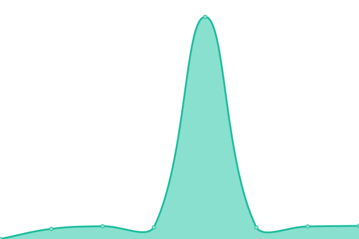
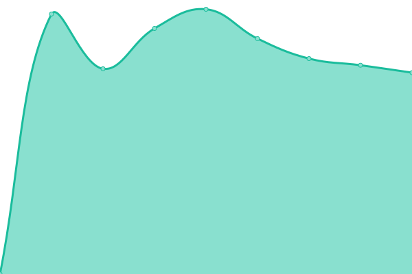

# [📈 Live Status](https://demo.upptime.js.org): <!--live status--> **🟧 Partial outage**

This repository contains the open-source uptime monitor and status page for [Upptime](https://upptime.js.org), powered by [Upptime](https://github.com/upptime/upptime).

With [Upptime](https://upptime.js.org), you can get your own unlimited and free uptime monitor and status page, powered entirely by a GitHub repository. We use [Issues](https://github.com/upptime/upptime/issues) as incident reports, [Actions](https://github.com/the91end/adins-status/actions) as uptime monitors, and [Pages](https://demo.upptime.js.org) for the status page.

<!--start: status pages-->
<!-- This summary is generated by Upptime (https://github.com/upptime/upptime) -->
<!-- Do not edit this manually, your changes will be overwritten -->
<!-- prettier-ignore -->
| URL | Status | History | Response Time | Uptime |
| --- | ------ | ------- | ------------- | ------ |
|  [Website](https://www.ad-ins.com) | 🟩 Up | [website.yml](https://github.com/the91end/adins-status/commits/HEAD/history/website.yml) | 

 1495ms
     
 | 

<a href="https://the91end.github.io/adins-status/history/website">0.00%</a>
    

|  [FAST](https://livefaster.ad-ins.com) | 🟩 Up | [fast.yml](https://github.com/the91end/adins-status/commits/HEAD/history/fast.yml) | 

 1138ms
     
 | 

<a href="https://the91end.github.io/adins-status/history/fast">0.00%</a>
    

|  [TFS](https://tfs.ad-ins.com/tfs) | 🟥 Down | [tfs.yml](https://github.com/the91end/adins-status/commits/HEAD/history/tfs.yml) | 

 696ms
     
 | 

<a href="https://the91end.github.io/adins-status/history/tfs">100.00%</a>
    

|  [E-PRF](https://eprf.ad-ins.com) | 🟩 Up | [e-prf.yml](https://github.com/the91end/adins-status/commits/HEAD/history/e-prf.yml) | 

 3870ms
     
 | 

<a href="https://the91end.github.io/adins-status/history/e-prf">0.00%</a>
    

|  [E-PJM](https://epjm.ad-ins.com) | 🟥 Down | [e-pjm.yml](https://github.com/the91end/adins-status/commits/HEAD/history/e-pjm.yml) | 

 0ms
     
 | 

<a href="https://the91end.github.io/adins-status/history/e-pjm">100.00%</a>
    

<!--end: status pages-->

[**Visit our status website →**](https://demo.upptime.js.org)

## 📄 License

- Powered by: [Upptime](https://github.com/upptime/upptime)
- Code: [MIT](./LICENSE) © [Upptime](https://upptime.js.org)
- Data in the `./history` directory: [Open Database License](https://opendatacommons.org/licenses/odbl/1-0/)
